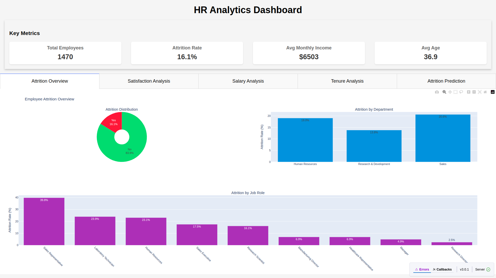

# HR Analytics Dashboard

## Project Overview

A comprehensive HR analytics dashboard that visualizes key HR metrics and provides predictive capabilities for employee
attrition. Built with Python, Pandas, Scikit-Learn, and Dash.



## Features

- **Interactive Data Visualization**: Analyze employee data through customizable charts and graphs
- **Employee Attrition Analysis**: Identify patterns and factors contributing to employee turnover
- **Predictive Modeling**: Forecast employee attrition risk using machine learning algorithms
- **Performance Metrics**: Track key HR KPIs including satisfaction, compensation, and tenure
- **Interactive Filtering**: Filter data by department, job role, gender, and other attributes
- **High-Risk Employee Identification**: Prioritize retention efforts for employees most likely to leave

## Project Structure

```
hr_analytics_dashboard/
├── data/
│   └── WA_Fn-UseC_-HR-Employee-Attrition.csv
├── notebooks/
│   ├── load_data_set.py
│   └── exploratory_data_analysis.py
├── visualizations/
│   └── (generated visualization files)
├── src/
│   ├── data_processing.py
│   ├── metrics.py
│   ├── models.py
│   └── visualization.py
├── dashboard/
│   └── app.py
├── start.sh
├── stop.sh
└── README.md
```

## Installation and Setup

### Prerequisites

- Python 3.8+
- pip or conda package manager

### Installation Steps

1. Clone the repository:
   ```
   git clone [repository-url]
   cd hr_analytics_dashboard
   ```

2. Create and activate a virtual environment:
   ```
   python -m venv .venv
   source .venv/bin/activate  # On Windows: .venv\Scripts\activate
   ```

3. Install required packages:
   ```
   pip install -r requirements.txt
   ```

## Running the Application

### Using the Start/Stop Scripts

#### On Linux/Mac:

- To start the application:
  ```
  ./start.sh
  ```
- To stop the application:
  ```
  ./stop.sh
  ```

### Manual Start

If you prefer to run the application manually:

```
python dashboard/app.py
```

The application will be accessible at http://127.0.0.1:8050/ after starting.

## Data Source

This project uses the IBM HR Analytics Employee Attrition dataset, which contains employee data such as age, job role,
salary, satisfaction levels, and attrition status. The dataset can be found on
Kaggle: [IBM HR Analytics Employee Attrition Dataset](https://www.kaggle.com/datasets/pavansubhasht/ibm-hr-analytics-attrition-dataset).

## Key Components

### Data Processing (`src/data_processing.py`)

Handles data loading, preprocessing, and feature engineering for the HR dataset.

### Metrics Calculation (`src/metrics.py`)

Calculates key HR metrics including attrition rates, satisfaction scores, and performance indicators.

### Predictive Modeling (`src/models.py`)

Implements machine learning models to predict employee attrition risk and identify factors contributing to turnover.

### Visualization (`src/visualization.py`)

Creates interactive visualizations for the dashboard including charts, graphs, and heatmaps.

### Dashboard Application (`dashboard/app.py`)

Integrates all components into an interactive web dashboard with filtering capabilities.

### Interpreting Visualizations

1. **Attrition Overview**: Shows attrition distribution and rates by department and job role
2. **Satisfaction Analysis**: Compares satisfaction metrics between employees who stay vs. leave
3. **Salary Analysis**: Examines income distribution and its relationship to other factors
4. **Tenure Analysis**: Analyzes how long employees stay and how that relates to attrition
5. **Attrition Prediction**: Shows the most important factors predicting employee turnover

### Using Predictive Insights

- The model metrics show how accurate the attrition predictions are
- Feature importance charts help identify which factors to focus on for retention
- The high-risk employee table shows which employees might need additional attention

## Future Enhancements

- Add downloadable reports and PDF export
- Implement dropdown menus to filter by department, job role, or gender
- All visualizations and metrics will update automatically based on your selections in dropdown
- Implement what-if analysis for retention strategies
- Add forecasting for workforce planning
- Integrate with external HR systems
- Add user authentication and multiple user roles
- Create mobile-responsive design

## Troubleshooting

### Common Issues

- **Dashboard won't start**: Ensure all dependencies are installed and the virtual environment is activated
- **Visualizations not loading**: Check browser console for errors and ensure data file is in the correct location

## Acknowledgments

- IBM for the original dataset
- Kaggle for hosting the dataset
- The Dash and Plotly team for the visualization framework
